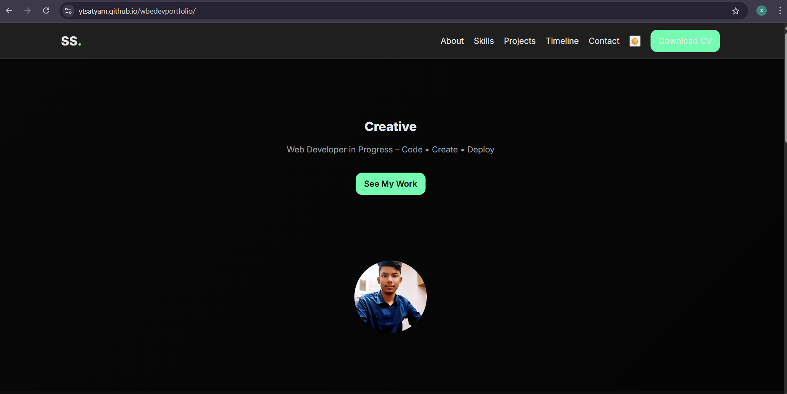

# 🌐 Satyam Shiv — Personal Portfolio

A responsive, dark-/light-toggle portfolio built with **HTML + CSS + Vanilla JS**.  
Showcases my projects, tech stack, experience timeline, and contact links — all deployable on GitHub Pages in minutes.

---

## 🚀 Live Demo
<https://ytsatyam.github.io/webdevportfolio/>

---

## ✨ Features

| Feature | Details |
|---------|---------|
| **Typewriter Hero** | Dynamic tagline cycles through “Developer / Problem-Solver / Creative Coder”. |
| **Dark / Light Toggle** | Implemented with CSS custom properties — no external libraries. |
| **Interactive Cursor** | Subtle neon-green trail on mouse move for a modern feel. |
| **Hover-Lift Project Cards** | Micro-interactions that hint at clickability. |
| **Responsive Grid** | Fluid layout from mobile → desktop (flex & grid, no Bootstrap). |
| **Download-CV Button** | One-click PDF download. |
| **Experience Timeline** | Clean vertical timeline built with pure CSS. |

---

## 🛠 Tech Stack

- **HTML5** semantic structure  
- **CSS3** custom properties, grid, flexbox  
- **JavaScript (ES6)** for interactivity  
- Deployed via **GitHub Pages**

---

## 📂 Project Structure

portfolio/
├─ index.html
├─ style.css
├─ script.js
├─ assets/
│ ├─ satyam-photo.jpg
│ ├─ portfolio-screenshot.png
│ ├─ cv.pdf
│ └─ favicon.png
└─ README.md
